## Subsystem 1: Power

*Table 1: Power Component Selection*

### Bucking Voltage Regulator

1. LM2575M-3.3 Bucking Voltage Regulator

    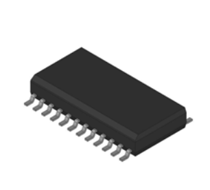

    * $0.94/each
    * [Product Link](https://www.digikey.com/en/products/detail/rochester-electronics-llc/LM2575M-3-3/12118456)

    | Pros                                      | Cons                                                             |
    | ----------------------------------------- | ---------------------------------------------------------------- |
    | Relatively solder friendly                | Generates switching noise ripple                                 |
    | No heat sink required in some designs     | Limited to 1A output                                             |
    |                                           | Efficiency drops under light loads

2. LM7805MPX/NOPB Bucking Voltage Regulator

    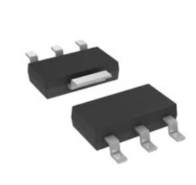

    * $1.43/each
    * [Product Link](https://www.digikey.com/en/products/detail/texas-instruments/LM7805MPX-NOPB/6110583)

    | Pros                                                              | Cons                                 |
    | ----------------------------------------------------------------- | -------------------------------------|
    | Very low noise output                                             | Poor efficiency at high voltages     |
    | Doesn't require many external components                          | Limited to 1A output                 |
    | Widely available and inexpensive                                  |

3. LM2596S-(5.0/3.3V)/NOPB Bucking Voltage Regulator

    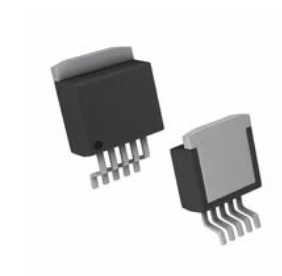

    * $6.97/each
    * [Product Link](https://www.digikey.com/en/products/detail/texas-instruments/LM2596S-5-0-NOPB/334842)

    | Pros                                                              | Cons                                 |
    | ----------------------------------------------------------------- | -------------------------------------|
    | High efficiency at moderate to high current                       | Generates switching noise            |
    | Has a shutdown feature                                            | Feedback trace must be isolated      |
    | Widely used, readily available reference designs                  | May be difficult to solder           |

**Choice:** LM2596S-(5.0/3.3V)/NOPB Bucking Voltage Regulator

**Rationale:** The best choice is the LM2596S/NOPB for 5V output and 3.3V as it has a high efficiency at a much higher current load (3A), incorporates a shutdown feature, and is widely used with available reference designs. The high current load is better suited for our project as we will be using a small DC motor to close the underground PCB box in the event of extreme weather conditions. Furthermore, the shutdown feature can be used to turn off all critical components in the event that the underground PCB box must close.

## Subsystem 2: Sensors 

*Table 2: Sensor Component Selection*

### Atmospheric Sensors

1. BME 280 - Humidity, Temperature, and Pressure Sensor

    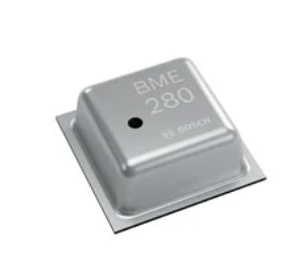

    * $4.03/each
    * [Product Link](https://www.digikey.com/en/products/detail/bosch-sensortec/BME280/6136306)

    | Pros                                                              | Cons                                 |
    | ----------------------------------------------------------------- | -------------------------------------|
    | Low power consumption                                             | Sensitive to harsh weather           |
    | Senses 3 data types                                               | More complex coding                  |
    | API library available for use on github                           |                     

2. AMG8833-Temperature IR Sensor

    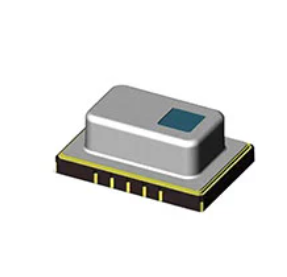

    * $1.43/each
    * [Product Link](https://www.digikey.com/en/products/detail/texas-instruments/LM7805MPX-NOPB/6110583)

    | Pros                                                              | Cons                                 |
    | ----------------------------------------------------------------- | -------------------------------------|
    | Very low noise output                                             | Poor efficiency at high voltages     |
    | Doesn't require many external components                          | Limited to 1A output                 |
    | Widely available and inexpensive                                  |

3. SHT31-DIS-B2.5KS - Humidity & Temperature Sensor

    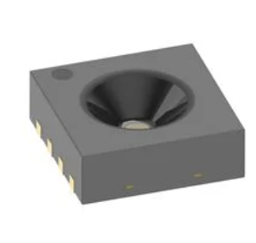

    * $4.01/each
    * [Product Link](https://www.digikey.com/en/products/detail/sensirion-ag/SHT31-DIS-B2-5KS/5872252?)

    | Pros                                                              | Cons                                 |
    | ----------------------------------------------------------------- | -------------------------------------|
    | Two distinctive, user selectable I2C addresses                    | Generates switching noise            |
    | Wide input voltage range                                          | Feedback trace must be isolated      |
    | NIST traceable measurements (industry standard)                   | May be difficult to solder           |

**Choice:** BME 280 - Humidity, Temperature, and Pressure Sensor

**Rationale:** The best choice for this subsystem is the BME 280 as it senses multiple variables within one package, which prevents I2C bus problems. The code is intensive, but an API library is available on github and the datasheet offers code examples to follow.  

## Subsystem 3: Control Panel 

*Table 3: Red LED Component Selection*

### Wildfire Susceptibilite Indicating LED

1. HLMP-Q150-F0011 Red LED

    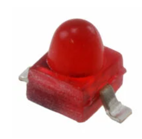

    * $2.01/each
    * [Product Link](https://www.digikey.com/en/products/detail/broadcom-limited/HLMP-Q150-F0011/1235258)

    | Pros                                                              | Cons                                 |
    | ----------------------------------------------------------------- | -------------------------------------|
    | Easiest to solder                                                 | Expensive                            |
    | High visibility                                                   | Takes up space                       |
    | Heat resistant                                                    |                     

2. SML-D12U1WT86 LED

    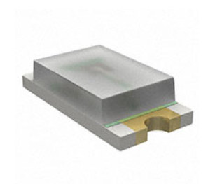

    * $0.12/each
    * [Product Link](https://www.digikey.com/en/products/detail/rohm-semiconductor/SML-D12U1WT86/5843853)

    | Pros                                                              | Cons                                 |
    | ----------------------------------------------------------------- | -------------------------------------|
    | Inexpensive                                                       | Vulnerable to thermal cycling        |
    | Compact                                                           | Difficult to solder                  |
    | Very bright for its size                                          |

3. APT2012SURCK LED

    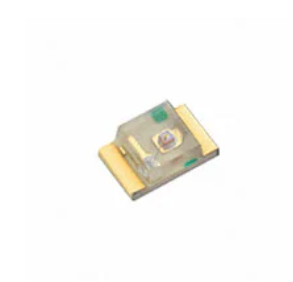

    * $0.20/each
    * [Product Link](https://www.digikey.com/en/products/detail/kingbright/APT2012SURCK/1747532)

    | Pros                                                              | Cons                                 |
    | ----------------------------------------------------------------- | -------------------------------------|
    | Low power consumption                                             | Difficult to solder                  |
    | Small footprint                                                   | Fragile                              |
    | Vibrant red, suitable for status indication                       |            

**Choice:** HLMP-Q150-F0011 Red LED

**Rationale:** Option 1 is the best choice for our design because it’s the least fragile and easiest to manually solder of the 3. Furthermore, having the highest visibility possible is important for warning the user of wildfire susceptibility.

*Table 4: Sensor LED Component Selection*

###  Sensor Threshold LEDs

1. XL-1606UBC LED

    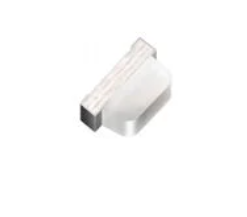

    * $0.01042/each
    * [Product Link](https://www.digikey.com/en/products/detail/xinglight/XL-1606UBC/25673224?s=N4IgjCBcoMwOxVAYygMwIYBsDOBTANCAPZQDaIMATAAwAstEAuoQA4AuUIAymwE4CWAOwDmIAL6EAbAE5EIFJAw4CIAG6CofAK4qSkcrWrSYxkMxDtOPASPGEYYWdHloseQnvJhKAVkoxJM1YOSG4%2BIVEJEABaQOcFbV0yCjMo6Mo5BN4dD2SfVKj85xYoMFYSyF8ouNB%2BABNOeBBgq3DbQjYATxZcTjrsFDExIA)

    | Pros                                                              | Cons                                 |
    | ----------------------------------------------------------------- | -------------------------------------|
    | Inexpensive                                                       | Difficult to solder by hand          |
    | Compact footprint                                                 | Lower visibility                     |
    | Low power consumption                                             |                     

2. ALMD-CB1E-VW002 LED

    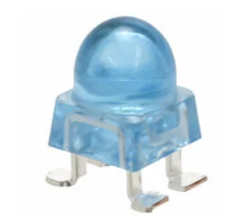

    * $1.20/each
    * [Product Link](https://www.digikey.com/en/products/detail/broadcom-limited/ALMD-CB1E-VW002/7325047)

    | Pros                                                              | Cons                                 |
    | ----------------------------------------------------------------- | -------------------------------------|
    | Low power consumption                                             | Takes up space                       |
    | Fast switching speed                                              | Limited viewing angle                |
    | High brightness                                                   |

3. 150141RB73100 RGB LED

    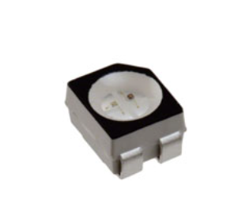

    * $0.34/each
    * [Product Link](https://www.digikey.com/en/products/detail/w%C3%BCrth-elektronik/150141RB73100/4489963)

    | Pros                                                              | Cons                                 |
    | ----------------------------------------------------------------- | -------------------------------------|
    | RGB LED                                                           | Thermal management complications     |
    | Compact                                                           | Requires multiple control channels   |
    | Vibrant red, suitable for status indication                       |            

**Choice:** ALMD-CB1E-VW002 Blue LED

**Rationale:** Option 2 is the best choice for sensor threshold indication (humidity, temperature, wind direction) because of its low power consumption and high visibility. Furthermore, the RGB function of option 3 would go unused, making the further subsystem design complications unnecessary.

## Subsystem 4: Mechanical Casing & Inner Casing Temperature 

*Table 5: Mechanical Casing Selection*

### Mechanical Casing

1. High-grade ABS material

    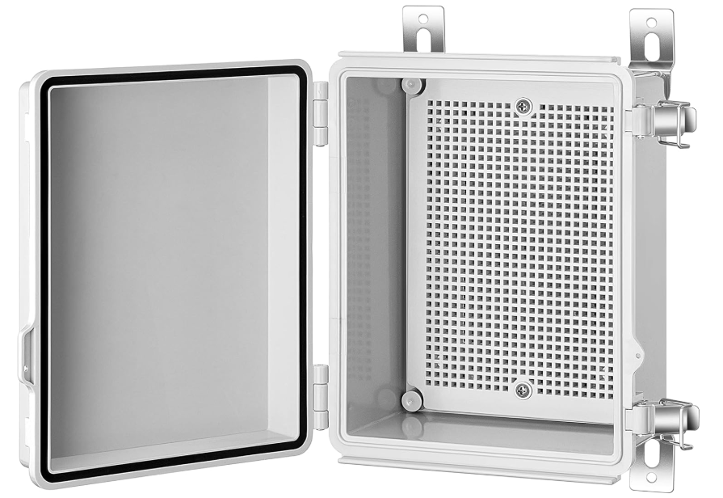

    * $49.99/each
    * [Product Link](https://www.amazon.com/Gratury-Waterproof-Enclosure-Electrical-370%C3%97270%C3%97150mm/dp/B08281V2RL/ref=asc_df_B0BFPXDN8M?tag=bingshoppinga-20&linkCode=df0&hvadid=80333201323789&hvnetw=o&hvqmt=e&hvbmt=be&hvdev=c&hvlocint=&hvlocphy=77827&hvtargid=pla-4583932719993871&th=1)

    | Pros                                                              | Cons                                 |
    | ----------------------------------------------------------------- | -------------------------------------|
    | Weatherproof & waterproof                                         | Not fireproof                        |
    | Mounting panel included for easy PCB installation                 | Not lightning proof                  |
    | Lightweight                                                       |                     

2. Diecast Aluminum

    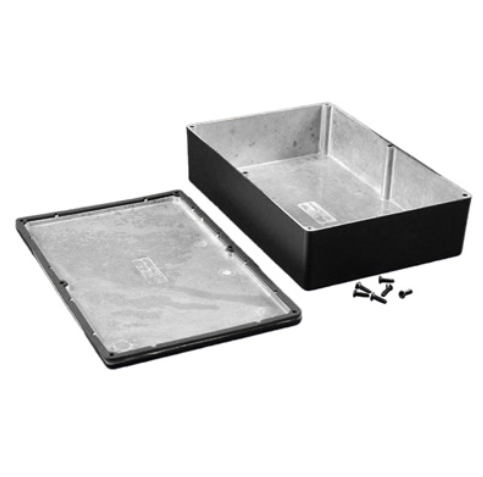

    * $43.29/each
    * [Product Link](https://www.solutionsdirectonline.com/1550wgbk-9x6x2-diecast-aluminum-enclosure-hammond-manufacturing?msclkid=d75319495d7a1ac47a2a71958aeaedcd&utm_source=bing&utm_medium=cpc&utm_campaign=**LP%20Shop%20-%20Catch%20All%20-%20Brand%20%3E%20Hammond&utm_term=4583726566566583&utm_content=Catch%20All%20-%20Hammond)

    | Pros                                                              | Cons                                 |
    | ----------------------------------------------------------------- | -------------------------------------|
    | IP66 Rated                                                        | Heavy                                |
    | IP66 Gasket included                                              | Hard to modify/drill into            |
    | Powder Coated Black                                               | Not fireproof                        |

3. Fireproof Box

    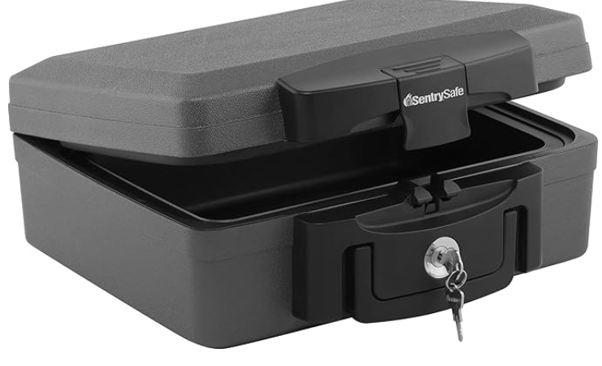

    * $42.50/each
    * [Product Link](https://www.amazon.com/SentrySafe-H0100-Fireproof-Waterproof-Cubic/dp/B00GE586CY?source=ps-sl-shoppingads-lpcontext&ref_=bing_fplfs&tag=txtadnwplace1-20&th=1)

    | Pros                                                              | Cons                                 |
    | ----------------------------------------------------------------- | -------------------------------------|
    | Fireproof                                                         | Expensive                            |
    | Waterproof                                                        | Heavy                                |
    | Durable                                                           | Thick walls                          |

**Choice:** High-grade ABS 

**Rationale:** The high-grade ABS will be the best material and composition as it is waterproof to help with groundwater. Furthermore, it already has a PCB mounting method and it is easy to drill into to add our external sensors. Some people would argue that this is not the best option because it is not fireproof. This problem is solved by burying the box at least 1 foot underground. This will keep our electronics safe in the event of a wildfire.

*Table 6: Inner Casing Temperature Sensor Selection*

### Inner Casing Temperature Sensor

1. TC74A4-3.3VCTTR Temperature Sensor

    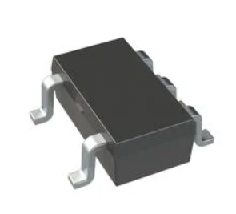

    * $1.15/each
    * [Product Link](https://www.digikey.com/en/products/detail/microchip-technology/TC74A4-3-3VCTTR/443268)

    | Pros                                                              | Cons                                 |
    | ----------------------------------------------------------------- | -------------------------------------|
    | Cheap                                                             | Fragile                              |
    | Fairly accurate                                                   | error margin up to 3 degrees         |
    | Fairly simple to solder                                           |                     

2. SLTM20W87F Temperature Sensor

    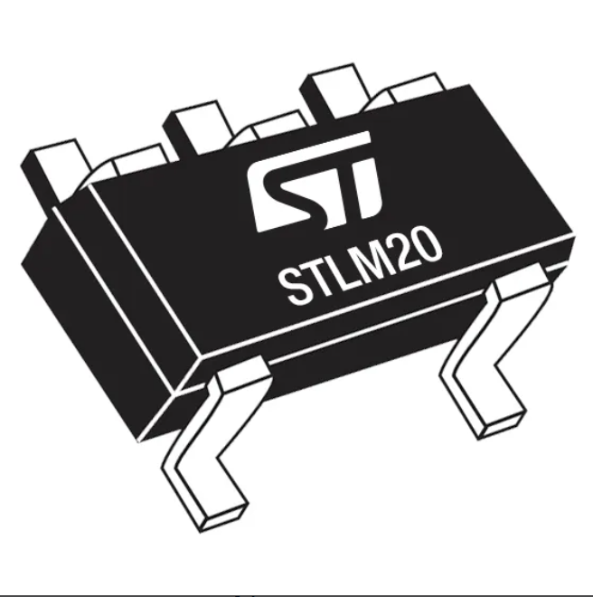

    * $0.76/each
    * [Product Link](https://estore.st.com/en/stlm20w87f-cpn.html?)

    | Pros                                                              | Cons                                 |
    | ----------------------------------------------------------------- | -------------------------------------|
    | Cheap                                                             | Fragile                              |
    | Measures up to 130 degrees Celsius                                | Older I2C timing                     |
    | Easy to solder                                                    | Slow temperature updates             |

3. AS6218-AWLT-L Temperature Sensor

    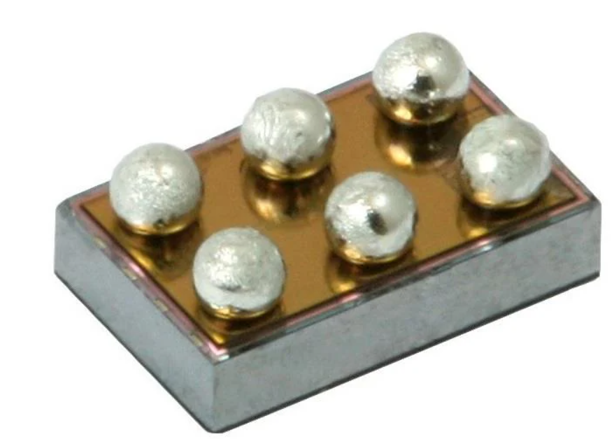

    * $1.09/each
    * [Product Link](https://www.mouser.com/ProductDetail/ams-OSRAM/AS6218-AWLT-L?qs=xZ%2FP%252Ba9zWqY9z325DmyZ1Q%3D%3D&mgh=1&utm_source=chatgpt.com)

    | Pros                                                              | Cons                                 |
    | ----------------------------------------------------------------- | -------------------------------------|
    | Measures up to 125 degrees Celsius                                | Fragile                              |
    | Accurate up to 0.8 degrees Celsius                                | Could be hard to solder              |
    | Can mount straight to PCB                                         |              

**Choice:** TC74A4-3.3VCTTR Temperature Sensor 

**Rationale:** The component we are going with is the TC74 because we have stock of this sensor and will not cost us to use. It will meet all the requirements needed for this sensor. If we did not have this sensor in stock the best option would be the SLTM20 due to it being the most resistant to high temperatures, has a better accuracy than the TC74, and is the cheapest unit.

### Inner Casing Motor Driver

*Table 7: Inner Casing Motor Driver Selecction*

1. TI DRV8835 Motor Driver

    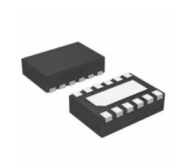

    * $1.95/each
    * [Product Link](https://www.digikey.com/en/products/detail/texas-instruments/DRV8835DSSR/3088201)

    | Pros                                                              | Cons                                 |
    | ----------------------------------------------------------------- | -------------------------------------|
    | Cheap                                                             | Lower top motor voltage              |
    | Low Voltage Operation (VM input: 0-11V)                           | Lots of pins to solder               |
    | 1.5A continuous current                                           |                    

2. TI DRV8833 Motor Driver

    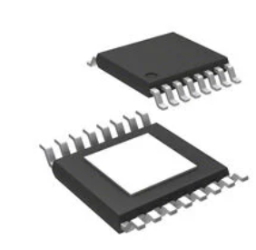

    * $2.18/each
    * [Product Link](https://www.digikey.com/en/products/detail/texas-instruments/DRV8833CPWPR/4972147)

    | Pros                                                              | Cons                                 |
    | ----------------------------------------------------------------- | -------------------------------------|
    | Built in current regulation                                       | Will shutdown at consistent high load|
    | Over temperature protection features                              | Uses more MCU pins than others       |
    | Compatible with 3.3V logic                                        |             

3. TI DRV8838 Motor Driver

    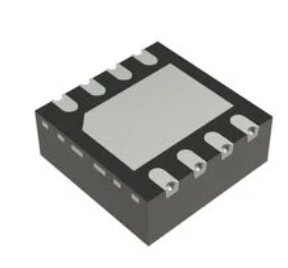

    * $1.03/each
    * [Product Link](https://www.digikey.com/en/products/detail/texas-instruments/DRV8838DSGR/4767638?s=N4IgTCBcDaICICUBqAOFBmFcDKBxBIAugL5A)

    | Pros                                                              | Cons                                 |
    | ----------------------------------------------------------------- | -------------------------------------|
    | Does not take up a lot of MCU I/O                                 | Solder using heat plate              |
    | Up to 1.8A continuous current                                     | No stall handling built in           |
    | Built in protections                                              | Needs good copper traces             |

**Choice:** TI DRV8838 Motor Driver 

**Rationale:** The best choice is the TI DRV8838 Motor Driver as it satisfies our basic project needs while having manageable cons compared to other choices. Even though it will require a heat plate to solder and needs good copper traces, these can be easily learned and implemented. In contrast, a motor driver that will shutdown at a consistent high load or use more MCU pins could lead to substantial issues. Furthermore, this motor driver has slightly more headroom on continuous current. 

## Subsystem 5: Wireless Communication 

*Table 8: Wireless Communication Selection*

### Wireless Communication

1. ESP-NOW

    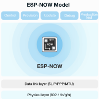

    * N/A cost
    * [Product Link](https://www.espressif.com/en/solutions/low-power-solutions/esp-now)

    | Pros                                                              | Cons                                 |
    | ----------------------------------------------------------------- | -------------------------------------|
    | Low latency                                                       | Only pairs up to 20 devices          |
    | Simple API (no low level programming)                             | Only works with Espressif devices    |
    | Easily integrates with ESP32                                      |                     

2. ESP-MESH

    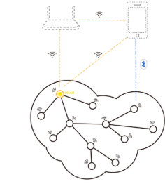

    * N/A cost
    * [Product Link](https://www.espressif.com/en/products/sdks/esp-wifi-mesh/overview)

    | Pros                                                              | Cons                                 |
    | ----------------------------------------------------------------- | -------------------------------------|
    | Up to 10Mbps of data transfer                                     | Greater power consumption            |
    | Mesh automatically forms                                          | More complex API                     |
    | Mesh self heals                                                   |                         
 
3. Bluetooth (ESP-IDF)

    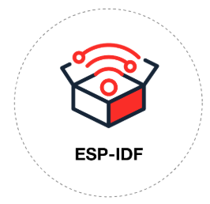

    * N/A cost
    * [Product Link](https://www.espressif.com/en/products/sdks/esp-idf)

    | Pros                                                              | Cons                                 |
    | ----------------------------------------------------------------- | -------------------------------------|
    | Lots of documentation and examples                                | Higher latency                       |
    | VS Code extension available                                       | Most complex API                     |
    | Security measures                                                 |                          

**Choice:** ESP-NOW 

**Rationale:** The best choice for wireless communication is ESP-NOW. Although it can only pair with up to 20 Espressif devices, our network topology only requires a single device to pair with four other ESP32s. Furthermore, the setup code is simpler compared to other communication protocols and has a lower latency, which is important for real-time wildfire prediction and detection. ESP-NOW can be set up to support a multi-hop network, which is required for our product. However, if this proves to be too difficult, the next best choice would be ESP-MESH. 

## Summary Table of Major Components 

| Part Name/Description                                                  | Unit Quantity | Unit Cost | Manufacturer      | Manufacturer Part #         | Vendor       |  Total Cost  | Order Total |
|------------------------------------------------------------------------|---------------|-----------|-------------------|-----------------------------|--------------|--------------|-------------|
| IC REG BUCK 3V 3A TO263                                                | 4             | $3.32     | Texas Instruments | LM2596S-(3.3V)/NOPB         | Digikey      |  $13.28      |  $168.73    |
| 9V 12 W AC/DC External Wall Mount (Class II) Adapter Fixed Blade Input | 1             | $6.23     | GlobTek, Inc.     | 1939-WR9HD1333CCP-F(R6B)-ND | Digikey      |  $6.23       |             |
| BME 280 Breakout Board                                                 | 2             | $8.99     | HiLetgo           | GY-BME280-3.3               | Amazon       |  $17.98      |             |
| LED RED DIFFUSED GULL WING SMD                                         | 5             | $2.01     | Broadcom Limited  | HLMP-Q150-F0011             | Digikey      |  $10.05      |             |
| LED BLUE ROUND 4SMD                                                    | 25            | $1.20     | Broadcom Limited  | ALMD-CB1E-VW002             | Digikey      |  $30.00      |             |
| Junction box enclosure.  5.9"D x 10.6"W x 14.6"H                       | 1             | $49.99    | Gratury           | G                           | Amazon       |  $49.99      |             |
| ESP32 Microcontroller                                                  | 5             | $5.06     | Espressif Systems | ESP32-S3-WROOM-1-N4         | Digikey      |  $25.30      |             |
| ESP32 Snap Programmer                                                  | 3             | $5.30     | M5 Stack          | S006                        | Electromaker |  $15.90      |

### Final Component Selection Decision Making Process
The final components were chosen based on simplicity, cost, available code libraries & tutorials, and how well they fit the product requirements. All of the final components allow for Project Firesight to accomplish it's requirements. The switching voltage regulator provides stable power to the control panel and the weather station, which enables the product to function as intended. The BME 280 breakout board measures real-time environmental data to inform on wildfire susceptible areas. The LEDs are simple, but effective in indicating if an environmental threshold has been met and/or if a wildfire is susceptible in an area, which allows for a proactive approach to wildfire suppresion. The junction box is waterproof and durable, which protects the weather station components from the environment they are in, which is critical in maintaining product functionality. The snap programmer allows for the microcontroller to be programmed and the microcontroller controls the logic of the product, allowing for the transmission of real-time environmental data through ESP-NOW wireless communication. 

### Final Component Selection Feedback 
The teaching team advised to include an ESP32 Snap Programmer to the project's component list in case the USB programmer does not work. Thus, Electromaker's ESP32 Snap Programmer was added as a major component to Project Firesight. 

**_Note_**: The motor driver, DC motor, and internal temperature sensor were not included in the final prototype as the motor driver was unable to be properly soldered with the surface mount equipment provided at Peralta Lab. The OUT+ and OUT- pins that drive the motor would consistently short with the GND pin on the driver due to how small the driver and the pads were. Thus, the motor and related components are left out of the summary table as they were unused. 

## Battery Selection

### Power Budget (Weather Station)

| Component Name               | Part Number   | Supply (V) | # | Absolute Current (mA) | Total Current (mA) | Subtotal Current (mA) | Total Current Required (mA) |
|------------------------------|---------------|------------|---|-----------------------|--------------------|-----------------------|-----------------------------|
| ESP32-S3-WROOM-1             | N4            | 3.3 - 3.6  | 1 | 500                   | 500                | 3500.0036             | 4375.0045                   |
| IC REG BUCK 3.3V 3A TO263-5L | LM2596S-3.3   | 4.75 - 40  | 1 | 3000                  | 3000               |                       |                             |
| BME 280 Breakout Board       | GY-BME280-3.3 | 1.71 - 3.6 | 1 | 0.0036                | 0.0036             |

### Power Budget (Control Panel) 

| Component Name                 | Part Number     | Supply (V) | # | Absolute Current (mA) | Total Current (mA) | Subtotal Current (mA) | Total Current Required (mA) |
|--------------------------------|-----------------|------------|---|-----------------------|--------------------|-----------------------|-----------------------------|
| ESP32-S3-WROOM-1               | N4              | 3.3 - 3.6  | 1 | 500                   | 500                | 3622.0036             | 4527.5045                   |
| IC REG BUCK 3.3V 3A TO263-5L   | LM2596S-3.3     | 4.75 - 40  | 1 | 3000                  | 3000               |                       |                             |
| BME 280 Breakout Board         | GY-BME280-3.3   | 1.71 - 3.6 | 1 | 0.0036                | 0.0036             |                       |                             |
| LED RED DIFFUSED GULL WING SMD | HLMP-Q150-F0011 | 1.6        | 2 | 1                     | 2                  |                       |                             |
| LED BLUE ROUND 4SMD            | ALMD-CB1E-VW002 | 3.2        | 6 | 20                    | 120                |

**_Note_**: The total current required was calculated by multiplying the subtotal current by 1.25 to provide a 25% safety margin. 

The power budget was used to estimate the battery capacity required for final demonstration. Even though the switching voltage regulator can draw a current of up to 3A, during testing, the weather station board only pulled 13 mA from the school lab bench top power supplies. As a lithium ion battery was utilized for its recharging capabilities, and the switching voltage regulator requires a minimum voltage greater than what a one cell lithium ion battery can provide (3.7V), the team chose the cheapest two cell lithium ion battery with recharging capabilities. The battery chosen was a 7.4V 5Ah lithium ion battery. The product link for the weather station battery is below. The control panel board is powered by a wall outlet through an AC-DC 9V barrel jack plug. 

**Cost**: $16.99

**Product Link**: [Product Link](https://www.amazon.com/dp/B0F1T8ZXN8?ref_=ppx_hzod_title_dt_b_fed_asin_title_0_0)