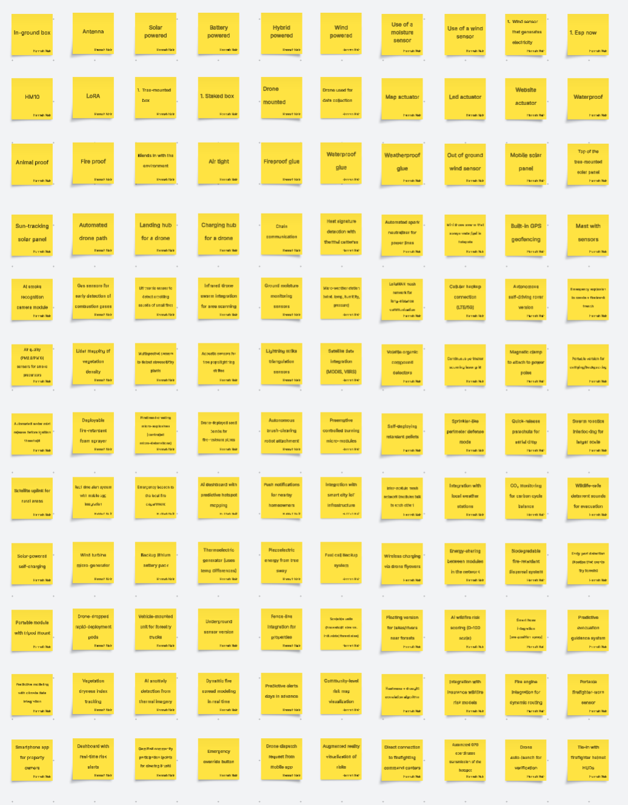
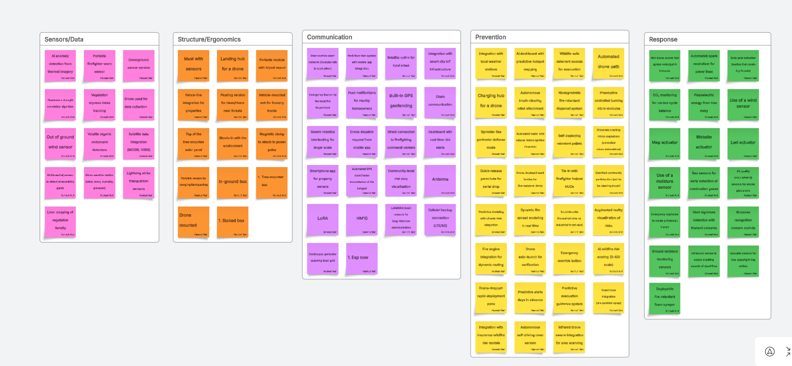
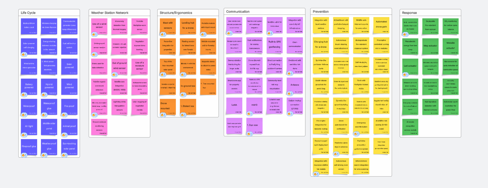
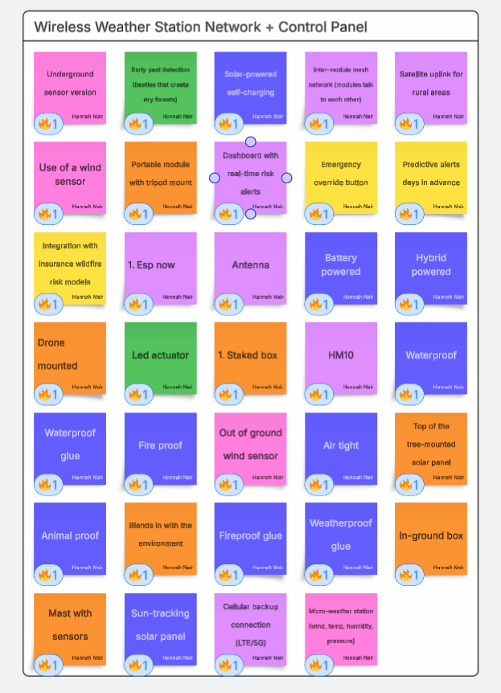
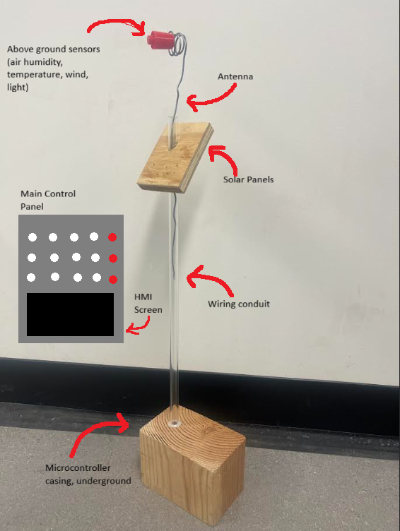

## Learning about Wildfire Response & Potential Stakeholders

The goal of our project is to provide a proactive approach to wildfire management and suppression. During the in-class stakeholder interview, the stakeholder spokesperson detailed that they only conduct a reactive approach to fighting wildfires; drones are only utilized to capture visual, thermal, and atmospheric details of an ongoing wildfire. Furthermore, the drones’ battery life only lasts for an hour, which limits the amount of data that can be collected. The spokesperson detailed that they receive predictive weather information from an outside organization, but did not describe how they process or utilize that information, or how long it takes for that information to be given. With the increasing unpredictability of weather phenomena, it is important that these extreme weather/environmental organizations have accurate, real-time data available. 

Thus, Project [name TBD] purpose is to create a wireless weather station network that will measure and transmit real-time weather data to a main control panel. Each weather station will measure atmospheric details, such as wind speed, air humidity, ground & air temperature, ground moisture, and more. This data will be sent to a primary control panel, which will have indicator LEDs to alert to the status of each weather station and indicate whether the area it is in is susceptible to wildfires. 

The audience for our project is both in academia and in industry. These stakeholders are our professor, Dr. Dajiang Suo, our teaching assistants, the State of Arizona’s Department of Forestry and Fire Management, local fire departments, local, state, and/or federal environmental agencies, environmental or wildlife research groups, and local residential communities. Our stakeholders can even extend to Arizona’s state government, as extreme wildfires can produce a domino effect of consequences that affect Arizona as a whole. 

## Idea Generation - Sort, Rank, Recombine, Group

The brainstorming process generated a total of 120 ideas. During the process, no idea was dismissed in order to encourage creative thinking. The ideas generated ranged from the type of sensors to use, how to use them, how the system will function, etc. The figure below depicts all of the ideas generated during this process. 

Afterwards, the generated ideas were sorted based on similar themes. The themes chosen were Life Cycle, Sensors/Data, Structure/Ergonomics, Communication, Prevention, and Response. The figure below depicts all of the ideas after being sorted. The 'Life Cycle' grouping is not shown due to issues with image size.

The ideas were then ranked based on how feasible they are, which was determined by budget constraints, time constraints, and if they satisfied the stakeholder needs (durability, survivability, and wireless real-time data). The figure below depicts the ranked ideas, which have a 'fire' emoji on them. 

Afterwards, the ranked ideas were improved upon, recombined, and finally grouped into our final product: a wireless weather station with a LED & HMI control panel. The figure below depicts the final grouping. 

Finally, a concept prototype was built out of everyday materials to envision Project Firesight. The figure below depicts the concept sketch/prototype. 

The features in our concept sketch satisfy the needs for wildfire response organizations by providing real-time data through wireless communication and the incorporation of a durable mechanical casing. 

    The wireless communication significantly reduces the amount of physical interaction between the product and the environment, satisfying the need for environmental protection. 
    
    The real-time data provides the opportunity for wildfire-related organizations to develop a proactive response, which increases the efficiency by which wildfire organizations can complete their duties. 
    
    Furthermore, the mechanical protection, underground features, and durability of the product ensures that it will survive in extreme weather conditions, which satisfies the need for a reliable & durable product. 

The workload for Project Firesight was divided into five subsystems that will be distributed evenly amongst the five teammates. These five subsystems are, Sensors, Mechanical Casing/Structures, ESP-NOW Communication, Power Supply, and Control Panel. It was foreseen that the sensor subsystem will require more attention, so the team decided to combine the sensor and power supply to a two-person team. The sensors will be communicating with the main control panel continuously. This panel will show when certain thresholds are met and have an indicator to when a certain area becomes a threat for a wildfire. The control panel will be a grid of LED lights that correspond to the type of sensor on the columns and the area that the sensor is in on the rows. The last LED in each row will indicate if an area is deemed wildfire-susceptibile. 

Our product will include labels on the control panel for each LED and each row, which indicate their function. The ‘wildfire susceptible’ LEDs (which indicate if the area the station is in is wildfire susceptible) will “breathe” using PWM at varying speeds to indicate the intensity of the susceptibility. As a stretch goal, our product could include a buzzer for added intensity indication if time permits.

Project Firesight will include an HMI screen to interface with the control panel. This HMI screen would adjust the sensor threshold value, as weather variables and conditions to produce a wildfire can vary with time. 

Durability, safety, and comfort will be very important to the end product because the installment of our modules is in remote and hard to reach areas, which is not something anyone wants to do twice. Durability during any sort of weather these areas can throw at us is of utmost importance, as no data can be transmitted if the station is incapacitated. Project Firesight will make sure wildlife does not interact with the product, as a curious animal may be able to destroy the product. Most importantly, the product must not be harmful to any ecosystems that it is within. 

Project Firesight will need to be installed manually, and reaching the remote forest can be a challenge. In addition, the modules will have to be calibrated to each other and confirm that all the modules are functioning together and communicating to the main control panel. To conduct this effectively, an instruction and maintenance manual will be provided that will cover the specifics.

Below is a YouTube presentation on Project Firesight's idea generation process:

