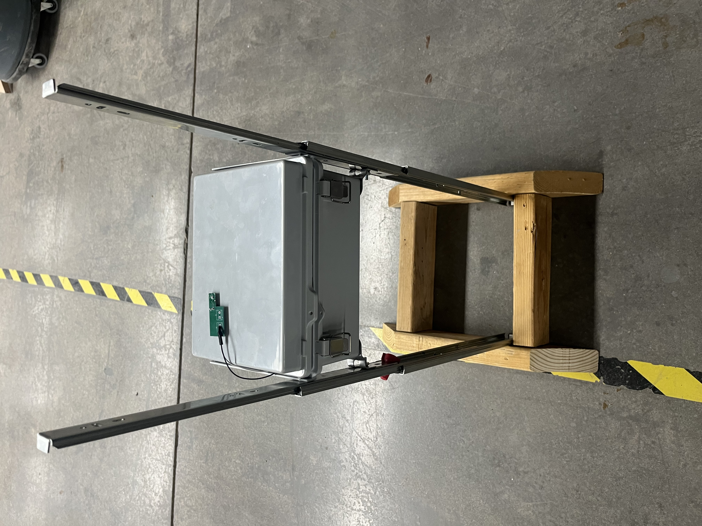

## Learning about Wildfire Response & Potential Stakeholders

The goal of our project is to provide a proactive approach to wildfire management and suppression. During the in-class stakeholder interview, the stakeholder spokesperson detailed that they only conduct a reactive approach to fighting wildfires; drones are only utilized to capture visual, thermal, and atmospheric details of an ongoing wildfire. Furthermore, the drones’ battery life only lasts for an hour, which limits the amount of data that can be collected. The spokesperson detailed that they receive predictive weather information from an outside organization, but did not describe how they process or utilize that information, or how long it takes for that information to be given. With the increasing unpredictability of weather phenomena, it is important that these extreme weather/environmental organizations have accurate, real-time data available. 

Thus, Project Firesight's purpose is to create a wireless weather station network that will measure and transmit real-time weather data to a main control panel. Each weather station will measure atmospheric details, such as wind speed, air humidity, ground & air temperature, ground moisture, and more. This data will be sent to a primary control panel, which will have indicator LEDs to alert to the status of each weather station and indicate whether the area it is in is susceptible to wildfires. 

The audience for our project is both in academia and in industry. These stakeholders are our professor, Dr. Dajiang Suo, our teaching assistants, the State of Arizona’s Department of Forestry and Fire Management, local fire departments, local, state, and/or federal environmental agencies, environmental or wildlife research groups, and local residential communities. Our stakeholders can even extend to Arizona’s state government, as extreme wildfires can produce a domino effect of consequences that affect Arizona as a whole. 

## Idea Generation & Initial Concept

The initial design concept's decision making process was through generating as much ideas as possible, organizing those generated ideas into grouped themes, ranking those grouped ideas based on feasibility and stakeholder needs, and finally, combining the highest ranked ideas. Please see the Appendix for a detailed description of the initial design concept's decision making process. 

A concept sketch was built out of everyday materials to envision Project Firesight. The figure below depicts the initial concept sketch.

*Figure 1: Initial Concept Sketch*

The features in our concept sketch satisfy the needs for wildfire response organizations by providing real-time data through wireless communication and the incorporation of a durable mechanical casing. 

The wireless communication significantly reduces the amount of physical interaction between the product and the environment, satisfying the need for environmental protection. 
    
The real-time data provides the opportunity for wildfire-related organizations to develop a proactive response, which increases the efficiency by which wildfire organizations can complete their duties. 
    
Furthermore, the mechanical protection, underground safety feature, and durability of the product ensures that it will survive in extreme weather conditions, which satisfies the need for a reliable & durable product. 

The control panel will show when certain environmental thresholds are met and have an indicator to when a certain area becomes a threat for a wildfire. The control panel will be a grid of LED lights that correspond to the type of measured environmental variable on the columns, and the rows represent each weather station. The last LED in each row will indicate if an area is deemed wildfire-susceptibile. Please see the Appendix for information on how the subsystems were split between the team members. 

Our product will include labels on the control panel for each LED and each row, which indicate their function. The ‘wildfire susceptible’ LEDs (which indicate if the area the station is in is wildfire susceptible) will “breathe” using PWM. As a stretch goal, our product could increase the intensity by which the LED breathes for added indication. 

Durability, safety, and comfort will be very important to the end product because the installment of our modules is in remote and hard to reach areas, which is not something anyone wants to install twice. Durability during any sort of weather these areas can throw at us is of utmost importance, as no data can be transmitted if the station is incapacitated. Project Firesight will make sure wildlife does not interact with the product, as a curious animal may be able to destroy the product or hurt itself in the process. Most importantly, the product must not be harmful to any ecosystems that it is within. 

The modules will have to be calibrated to each other and confirm that all the modules are functioning together and communicating to the main control panel. To conduct this effectively, an instruction and maintenance manual will be provided that will cover the specifics.

Below is a YouTube presentation on Project Firesight's idea generation process:

**_Note_**: The pictures utilized in the YouTube presentation are AI generated. 

<iframe width="560" height="315" src="https://www.youtube.com/embed/UdYc81qnbb8?si=eoMyjqz6b4XxD1y1" title="YouTube video player" frameborder="0" allow="accelerometer; autoplay; clipboard-write; encrypted-media; gyroscope; picture-in-picture; web-share" referrerpolicy="strict-origin-when-cross-origin" allowfullscreen></iframe>

## Final Design Concept 

The final design concept remained centered around a wireless weather station network transmitting environmental data to a central control panel. However, the final design concept did not include the HMI screen, solar panels, antenna, and antenna wiring conduit. The final concept also modified the underground feature. Below is a description of why each component was not included in the final design, and how the underground feature was modified. 

### HMI Screen

The HMI screen was not included due to budget and time constraints. The purpose of the HMI screen during intial concept generation was to adjust the threshold values for each environmental variable, as different seasons of the year could change the conditions that create a wildfire. The HMI screen that fit within our project's deadline was the Nextion HMI Screen, which costs around 80 dollars if bought from Digikey. All critical subsystems and supporting items created a project cost of approximately 280 dollars. Thus, adding the HMI screen would put the project over budget. 

### Solar Panels

The solar panels were not included due to budget constraints. The lithium batteries utilized had to be at least 7.4 volts due to the voltage input requirements of our voltage regulator. The purpose of the solar panels was to charge the lithium ion batteries, and therefore decrease the amount of maintenance on the weather stations. To incorporate solar panels in this manner, a solar charge controller board must be utilized to ensure the batteries are not overcharged. However, it was incredibly difficult finding a solar charge controller board that could take in 7.4 volts while also remaining within budget.

### Antenna & Antenna Wiring Conduit

The antenna was not included due to budget constraints. Furthermore, as this is a school project and not a full-fledged product, the team decided that the built in antenna on the microcontroller chip was sufficient. The wiring conduit is for the antenna and environmental sensors; the wiring conduit was removed as well since the antenna is no longer included, and the environmental sensors do not need external conduit due to modifications on the underground safety feature. 

### Modified Underground Safety Feature

The underground safety feature was modified to incorporate an electrical component based on feedback from the professor and TA's. The underground safety feature now includes a temperature sensor to measure the temperature INSIDE the weather station enclosure, a DC motor & motor driver, and a small 3D printed pin that will be pulled by the motor. The weather station PCB will still sit in its enclosure, but the enclosure will now be placed between sliders. The weather station's sliders will be fully extended; The motor pin will be mounted such that it "locks" the sliders in their fully extended position. Half of the length of the sliders will be in an underground hole, the other half will be above the hole to allow the environmental sensor to measure accurate data. Once the INTERNAL temperature sensor measures a temperature that could destroy the weather station's electronics, the DC motor will pull the motor pin, which will drop the weather station enclosure into the hole. This will ensure that the weather station's electronics will be safe if a wildfire is active in the weather station's area. Below is a concept sketch of the final concept design. 

*Figure 2: Final Concept Sketch*

