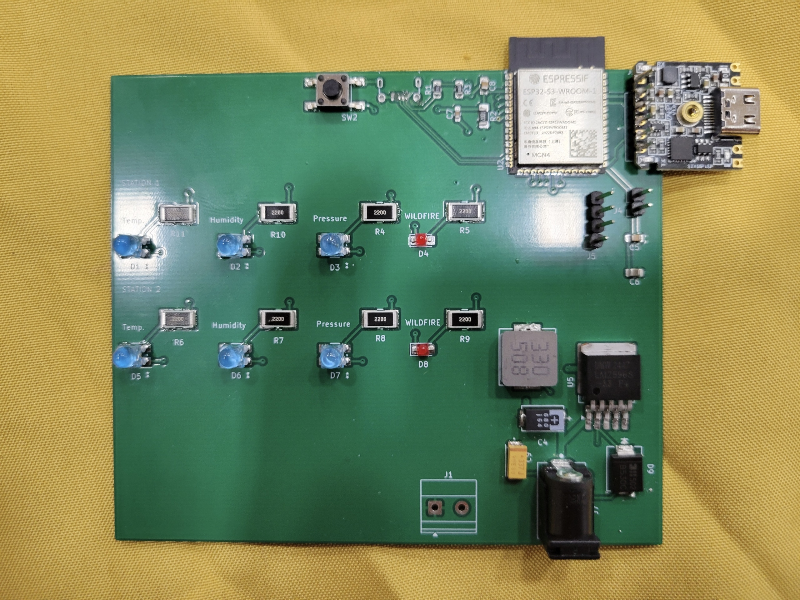
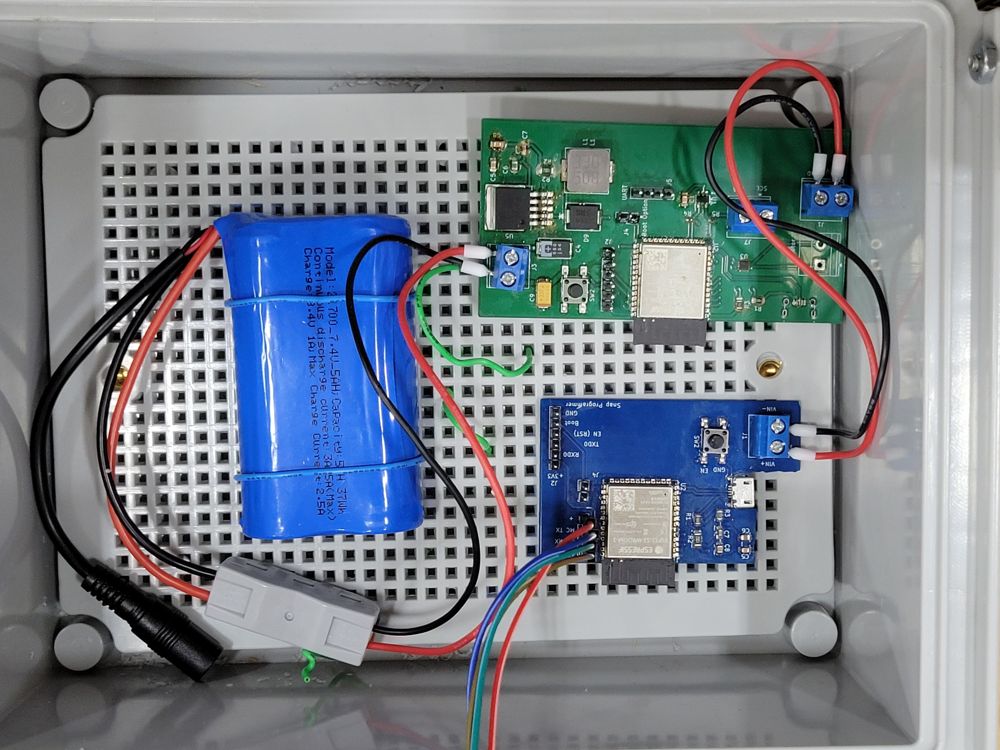

Project Firesight 

 Team Embermen 

 Hannah Nair, Luke Willet, Musye Gaim, Joshua Petrone 

 Fall 2025 

 ASU, Class 2026, Professor Suo 

**Preparation Date: December, 7th, 2025**

## Project Summary

Project Firesight is a wireless weather station network that sends real-time environmental data to a central control panel. The weather stations utilize the BME280 sensor, which measures the environment's temperature, relative humidity, and pressure. The central control panel has rows of indicator LEDs for each environmental variable measured, where each row represents one weather station. On the end of each row is a red indicator LED, which lights when that weather station's area is deemed susceptible to wilfires, i.e. when two out of three of the envionmental indicator LEDs light up. Project Firesight allows the user to detect wildfire susceptible areas BEFORE a potential wildfire starts, creating a proactive approach to fighting wildfires which increases the efficiency by which wildfires are suppressed. 

*Figure 1: Project Firesight - Weather Station*

*Figure 2: Project Firesight - Control Panel*

*Figure 3: Project Firesight - Weather Station PCB*

**_Note_**: The weather station PCB is the green PCB. During integration, the microcontroller on the weather station PCB fried, so the blue PCB's microcontroller was used. 

## Page Links

[Team Organization](./teamorg.md)

[Ideation and Concept Generation](./concept_gen.md)

[Component Selection](./component_selection/index.md)

[Block Diagram](./BlockDiag.md)

[Bill of Materials](./BOM.md)

[Team Schematic](./team-schematic.md)

