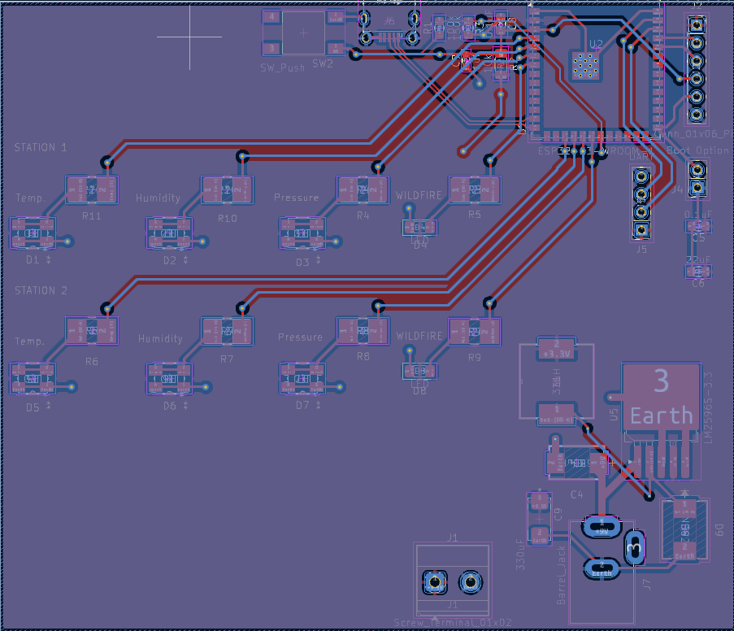
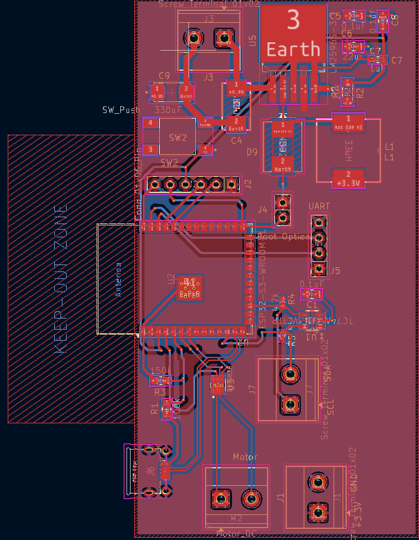

The EDA software used for this project was KiCad. The team schematic and PCBs are split into two -- one for the main control panel and one for the weather stations.

## Schematic

### Main Control Panel Circuit

*Figure 1: Control Panel Schematic*

### Weather Station Circuit

*Figure 2: Weather Station Schematic*

The schematic satisfies the user needs of the project as the power regulator circuit supplies +3.3V to all required power pins for all components in the weather station & control panel schematic. The product won't function as intended if it doesn't receive any power. The microcontroller for both schematics can be programmed either through the USB D- and D+ lines or through the snap programmer, in case any of the two options fail. This satisfies user needs as it provides the logic for the product, which allows for the transmission of real-time environmental data through wireless communication. For the control panel, the logic will indicate what areas are susceptible to wildfires, which enables proactive wildfire supression. 

## PCB Design

### Control Panel PCB

*Figure 3: Front Copper Layer - Control Panel*

*Figure 4: Back Copper Layer - Control Panel* 

### Weather Station PCB 

*Figure 5: Front Copper Layer - Weather Station* 

*Figure 6: Back Copper Layer - Weather Station*

 

