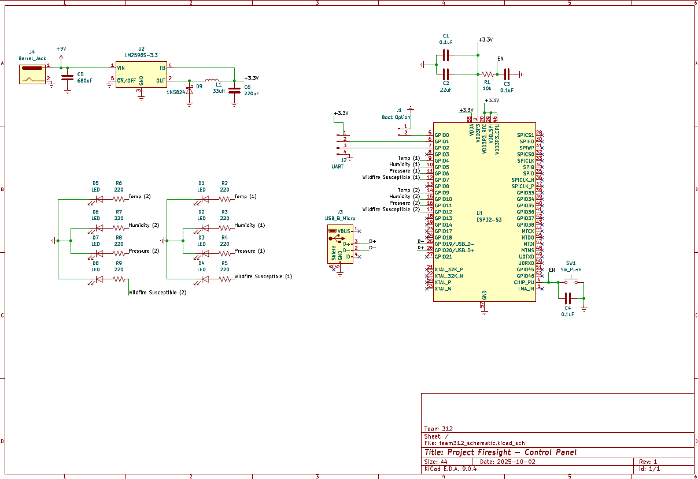
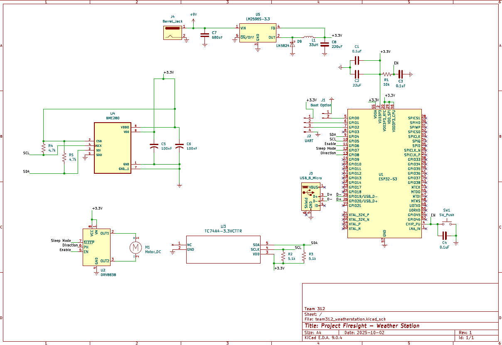

The team schematic is split into two -- one for the main control panel and one for the weather stations. The figures below show each schematic

## Main Control Panel Circuit

*Figure 1: Control Panel Schematic*

## Weather Station Circuit

*Figure 2: Weather Station Schematic*

